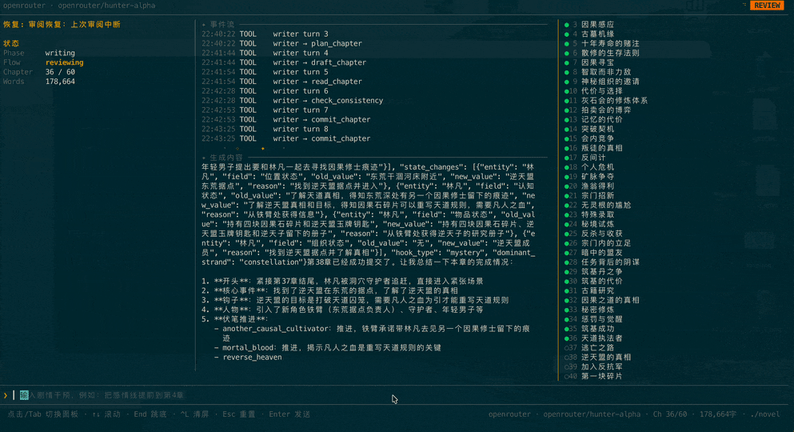
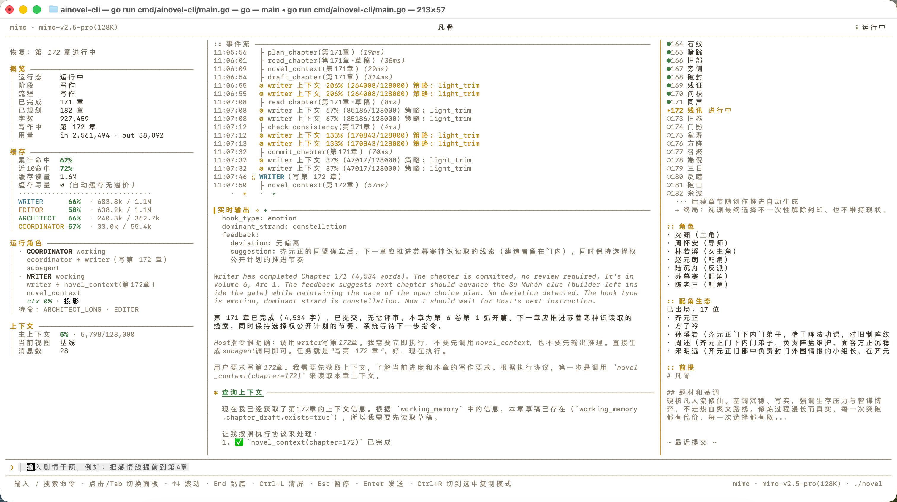

# ainovel-cli (Bản Tiếng Việt & Đa Ngôn Ngữ)

<p align="center">
  <strong>Công cụ dòng lệnh (CLI) sáng tác tiểu thuyết dài kỳ tự động bằng AI với kiến trúc Đa Agent (Multi-Agent)</strong>
</p>

<p align="center">
  
  
</p>

---

## 🌟 Điểm Nổi Bật Của Bản Việt Hóa & Đa Ngôn Ngữ

- 🇻🇳 **Giao diện TUI Việt hóa 100%**: Từ Setup Wizard cài đặt ban đầu, màn hình chào mừng, thanh trạng thái, Activity stream trực tiếp, bảng quản lý Provider/Model (`/config`, `/model`) đến thông báo lỗi và phím tắt đều được dịch sang Tiếng Việt chuẩn mực, tự nhiên.
- 🌐 **Tùy chọn Ngôn ngữ sáng tác truyện**: Hỗ trợ viết truyện bằng **Tiếng Việt (mặc định)** hoặc **Tiếng Trung nguyên bản** qua trường `"language": "vi"` hoặc `"language": "zh"` trong cấu hình.
- 🦙 **Tích hợp sẵn Ollama Local**: Hỗ trợ chạy 100% offline, miễn phí không tốn tiền API với các model mã nguồn mở chạy trên GPU nội bộ (Qwen 2.5 / 3.5, Llama, v.v.).
- ✍️ **Bộ Prompt song ngữ & Văn phong chống AI sáo rỗng**: 14 prompt hệ thống được tinh chỉnh kỹ lưỡng, kèm file quy chuẩn văn phong tiểu thuyết Tiếng Việt (`assets/voice.md`) giúp hành văn sống động, gãy gọn, có chiều sâu, bài trừ các mẫu câu sáo rỗng của AI.
- 🚀 **Đồng bộ toàn diện Upstream mới nhất**: Sở hữu đầy đủ kiến trúc Đa Agent (`Coordinator` → `Architect` → `Writer` → `Editor` → `Arbiter`), Prompt Caching 3 tầng, quy hoạch cuộn 2 tầng (Rolling planning), điểm phục hồi step-level, và toàn bộ 14 lệnh slash commands.

---

## 📑 Mục Lục
1. [Yêu Cầu Hệ Thống](#1-yêu-cầu-hệ-thống)
2. [Cài Đặt & Khởi Chạy Nhanh](#2-cài-đặt--khởi-chạy-nhanh)
3. [Tùy Chọn Ngôn Ngữ Sáng Tác](#3-tùy-chọn-ngôn-ngữ-sáng-tác)
4. [Cấu Hình Nhà Cung Cấp AI (LLM)](#4-cấu-hình-nhà-cung-cấp-ai-llm)
   - [Dùng Ollama Cục Bộ (100% Offline)](#dùng-ollama-cục-bộ-100-offline)
   - [Dùng Cloud API (OpenRouter, Gemini, Claude, OpenAI, DeepSeek)](#dùng-cloud-api-openrouter-gemini-claude-openai-deepseek)
   - [Phối hợp nhiều Model theo vai trò](#phối-hợp-nhiều-model-theo-vai-trò)
5. [Hướng Dẫn Sử Dụng & Bảng Lệnh TUI](#5-hướng-dẫn-sử-dụng--bảng-lệnh-tui)
   - [Khởi động TUI & Chế độ sáng tác](#khởi-động-tui--chế-độ-sáng-tác)
   - [Danh sách Lệnh Điều Khiển (Slash Commands)](#danh-sách-lệnh-điều-khiển-slash-commands)
   - [Can thiệp thời gian thực (Steer)](#can-thiệp-thời-gian-thực-steer)
   - [Chế độ chạy ngầm (Headless)](#chế-độ-chạy-ngầm-headless)
6. [Quản Lý Nhiều Bộ Truyện Độc Lập](#6-quản-lý-nhiều-bộ-truyện-độc-lập)
7. [Tính Năng Nâng Cao](#7-tính-năng-nâng-cao)
   - [Chẩn đoán truyện (`/diag`)](#chẩn-đoán-truyện-diag)
   - [Mô phỏng văn phong (`/simulate`)](#mô-phỏng-văn-phong-simulate)
   - [Đồng bộ sửa đổi thủ công (`/sync`)](#đồng-bộ-sửa-đổi-thủ-công-sync)
   - [Nhập truyện bên ngoài (`/import`)](#nhập-truyện-bên-ngoài-import)
   - [Xuất truyện hoàn chỉnh (`/export` TXT/EPUB)](#xuất-truyện-hoàn-chỉnh-export-txtepub)
8. [Kiến Trúc Kỹ Thuật & Nguyên Lý Hoạt Động](#8-kiến-trúc-kỹ-thuật--nguyên-lý-hoạt-động)
   - [Kiến trúc Đa Agent](#kiến-trúc-đa-agent)
   - [Quy hoạch cuộn 2 tầng (Rolling Planning)](#quy-hoạch-cuộn-2-tầng-rolling-planning)
   - [Quản lý & Nén ngữ cảnh 4 cấp](#quản-lý--nén-ngữ-cảnh-4-cấp)
   - [Đánh giá chất lượng 7 chiều của Editor](#đánh-giá-chất-lượng-7-chiều-của-editor)
   - [Khôi phục điểm ngắt (Step-level Recovery)](#khôi-phục-điểm-ngắt-step-level-recovery)
9. [Cấu Trúc Thư Mục Đầu Ra](#9-cấu-trúc-thư-mục-đầu-ra)
10. [Tùy Biến Văn Phong & Quy Tắc Cá Nhân](#10-tùy-biến-văn-phong--quy-tắc-cá-nhân)
11. [Tech Stack & License](#11-tech-stack--license)

---

## 1. Yêu Cầu Hệ Thống

- **Khuyến nghị nhất**: [Docker](https://www.docker.com/) & Docker Desktop (Windows / macOS / Linux).
- **Hoặc chạy từ Source**: Máy tính đã cài đặt [Go](https://go.dev/) ≥ 1.21.
- **LLM**: 
  - Máy có GPU (Nvidia VRAM ≥ 12GB) nếu muốn chạy Ollama cục bộ với model Qwen 2.5 / 3.5.
  - Hoặc API Key từ OpenRouter, Anthropic, Google Gemini, OpenAI, DeepSeek.

---

## 2. Cài Đặt & Khởi Chạy Nhanh

### Bước 1: Clone Repo & Chuẩn Bị Thư Mục
```bash
git clone https://github.com/kentjuno/ainovel-cli.git
cd ainovel-cli

# Tạo thư mục chứa cấu hình và thư mục chứa truyện
mkdir -p config workspace novels
```

### Bước 2: Build Docker Image
```bash
docker compose build
```
*(Nếu build từ source Go: `go build -o ainovel-cli ./cmd/ainovel-cli`)*

### Bước 3: Khởi Chạy TUI
```bash
docker compose run --rm ainovel
```
*(Nếu chạy từ file binary: `./ainovel-cli`)*

Lần đầu chạy, hệ thống sẽ tự động bật **Setup Wizard tương tác bằng Tiếng Việt** để bạn chọn Provider, nhập API Key/Base URL, chọn Model và Ngôn ngữ sáng tác.

---

## 3. Tùy Chọn Ngôn Ngữ Sáng Tác

Trong file cấu hình `config/config.json`, bạn có thể chỉ định trường `"language"`:
- `"language": "vi"` (**Mặc định**): Toàn bộ dàn ý, nhân vật, bối cảnh thế giới, quy chuẩn văn phong chống AI và nội dung từng chương sẽ được sinh ra bằng **Tiếng Việt** tự nhiên, mượt mà.
- `"language": "zh"`: Nội dung truyện được sinh ra bằng **Tiếng Trung** nguyên bản (phù hợp nếu bạn viết truyện Trung hoặc muốn dùng công cụ dịch sau).

> 💡 **Ghi chú**: Bảng điều khiển TUI, thanh trạng thái, menu và các thông báo lỗi luôn hiển thị **100% bằng Tiếng Việt**.

---

## 4. Cấu Hình Nhà Cung Cấp AI (LLM)

File cấu hình đặt tại `config/config.json`:

### Dùng Ollama Cục Bộ (100% Offline)

1. **Tạo model trên Ollama với Context Window lớn (65536 tokens)**:
   - Trên PowerShell (Windows):
     ```powershell
     @"
     FROM qwen2.5:14b
     PARAMETER num_ctx 65536
     "@ | Out-File -FilePath "$env:TEMP\ainovel.Modelfile" -Encoding ascii

     ollama create ainovel-qwen -f "$env:TEMP\ainovel.Modelfile"
     ```
2. **Nội dung `config/config.json`**:
   ```json
   {
     "language": "vi",
     "provider": "ollama",
     "model": "ainovel-qwen",
     "providers": {
       "ollama": {
         "base_url": "http://host.docker.internal:11434/v1",
         "stream_idle_timeout": "300s"
       }
     },
     "context_window": 65536,
     "thinking": "off",
     "style": "default"
   }
   ```
   > ⚠️ **Lưu ý mạng Docker**: Khi chạy bằng Docker, bắt buộc dùng `http://host.docker.internal:11434/v1`. Nếu chạy binary trực tiếp trên máy không qua Docker, dùng `http://localhost:11434/v1`.

---

### Dùng Cloud API (OpenRouter, Gemini, Claude, OpenAI, DeepSeek)

#### OpenRouter:
```json
{
  "language": "vi",
  "provider": "openrouter",
  "model": "anthropic/claude-3.5-sonnet",
  "providers": {
    "openrouter": {
      "api_key": "sk-or-v1-YOUR_OPENROUTER_API_KEY"
    }
  },
  "context_window": 128000,
  "thinking": "off",
  "style": "default"
}
```

#### Google Gemini:
```json
{
  "language": "vi",
  "provider": "gemini",
  "model": "gemini-2.5-pro",
  "providers": {
    "gemini": {
      "api_key": "YOUR_GEMINI_API_KEY"
    }
  },
  "context_window": 1000000,
  "style": "default"
}
```

#### DeepSeek API:
```json
{
  "language": "vi",
  "provider": "deepseek",
  "model": "deepseek-chat",
  "providers": {
    "deepseek": {
      "api_key": "YOUR_DEEPSEEK_API_KEY"
    }
  },
  "context_window": 64000,
  "style": "default"
}
```

---

### Phối hợp nhiều Model theo vai trò

Hệ thống cho phép gán model mạnh (Claude 3.5 Sonnet / DeepSeek Reasoner) làm **Biên tập / Kiến trúc sư** và model rẻ/nhanh (DeepSeek Chat / Ollama) làm **Người viết**:

```json
{
  "language": "vi",
  "provider": "ollama",
  "model": "ainovel-qwen",
  "providers": {
    "ollama": { "base_url": "http://host.docker.internal:11434/v1" },
    "openrouter": { "api_key": "sk-or-v1-YOUR_KEY" }
  },
  "roles": {
    "architect": { "provider": "openrouter", "model": "anthropic/claude-3.5-sonnet" },
    "editor": { "provider": "openrouter", "model": "anthropic/claude-3.5-sonnet" },
    "writer": { "provider": "ollama", "model": "ainovel-qwen" }
  },
  "context_window": 65536,
  "style": "default"
}
```

---

## 5. Hướng Dẫn Sử Dụng & Bảng Lệnh TUI

### Khởi động TUI & Chế độ sáng tác

Chạy lệnh:
```bash
docker compose run --rm ainovel
```

Tại màn hình chào mừng:
- **Phím Tab**: Chuyển đổi giữa 2 chế độ:
  - **Bắt đầu nhanh**: Nhập 1 câu tóm tắt ý tưởng (ví dụ: *"Tiểu thuyết tiên hiệp phàm nhân, nhân vật chính cơ trí, quyết đoán"*), AI tự động lập dàn ý và sáng tác ngay.
  - **Đồng sáng tác (Co-create)**: AI sẽ trao đổi cùng bạn từng bước để làm rõ thiết lập thế giới, nhân vật, cốt truyện trước khi viết.
- **Phím Enter**: Bắt đầu quá trình sáng tác.
- **Phím `/`**: Mở thanh tìm kiếm và thực thi lệnh nhanh (Slash Commands).
- **`Ctrl+C` 2 lần**: Lưu an toàn toàn bộ trạng thái và thoát ra.

---

### Danh sách Lệnh Điều Khiển (Slash Commands)

Khi đang ở trong giao diện TUI, bạn có thể gõ `/` để mở bảng chọn lệnh:

| Lệnh | Mô tả |
| :--- | :--- |
| `/help` | Mở bảng trợ giúp tra cứu danh sách lệnh và phím tắt |
| `/model` | Chuyển đổi Model hoặc mức độ suy luận (reasoning/thinking) |
| `/config` | Quản lý cấu hình Provider, Model ID, API Key, Base URL, Context Window |
| `/diag` | Xem báo cáo chẩn đoán toàn diện về sức khỏe, tiến độ và chất lượng truyện |
| `/review [on\|off]` | Bật/tắt chế độ nghiệm thu từng chương (dừng lại sau mỗi chương để bạn duyệt) |
| `/next` | Phê duyệt cho phép viết chương tiếp theo (khi ở chế độ nghiệm thu) |
| `/start <tệp>` | Đọc tệp dàn ý / ý tưởng bên ngoài để bắt đầu truyện mới |
| `/import <tệp>` | Nhập tiểu thuyết từ bên ngoài vào để AI phân tích và viết tiếp |
| `/reopen <hướng>` | Viết tiếp tập mới sau khi tác phẩm đã hoàn thành |
| `/cocreate` | Tạm dừng để vào chế độ đồng sáng tác định hướng giai đoạn tiếp theo |
| `/simulate` | Phân tích các file văn mẫu trong `./simulate` để mô phỏng văn phong |
| `/importsim <file>` | Nhập hồ sơ mô phỏng văn phong từ tệp json |
| `/sync` | Đồng bộ các chỉnh sửa thủ công của bạn trên các file chương vào hệ thống |
| `/export` | Xuất tác phẩm thành file văn bản hoàn chỉnh (.txt hoặc .epub) |

---

### Can thiệp thời gian thực (Steer)

Trong lúc AI đang viết, bạn có thể nhập trực tiếp ý kiến sửa đổi vào ô nhập liệu bên dưới bất cứ lúc nào mà **không cần tạm dừng hay khởi động lại**:

```text
❯ Cho nhân vật phụ A hy sinh ở cuối chương này để tạo bước ngoặt cảm xúc lớn
```

Sau khi nhấn Enter, Arbiter sẽ tự động đánh giá phạm vi ảnh hưởng và điều phối Writer/Editor cập nhật mạch truyện.

---

### Chế độ chạy ngầm (Headless)

Dành cho việc chạy tự động trên VPS, Server hoặc CI:
```bash
# Bắt đầu truyện mới
docker compose run --rm ainovel --headless --prompt "Tiểu thuyết huyền nghi đô thị phá án"

# Viết tiếp truyện đang dở trong thư mục hiện tại
docker compose run --rm ainovel --headless
```

---

## 6. Quản Lý Nhiều Bộ Truyện Độc Lập

Mặc định output sẽ lưu vào thư mục `workspace/`. Để viết nhiều bộ truyện khác nhau mà không bị xung đột, hãy đặt biến môi trường `NOVEL_DIR`:

```powershell
# Trên Windows PowerShell:
$env:NOVEL_DIR = ".\novels\tien-hiep-ky"
docker compose run --rm ainovel

# Viết bộ truyện khác:
$env:NOVEL_DIR = ".\novels\do-thi-di-nang"
docker compose run --rm ainovel
```

Cấu trúc thư mục đầu ra của mỗi truyện:
```text
novels/<tên-truyện>/output/novel/
├── chapters/            # Các chương hoàn chỉnh đã duyệt (.md)
├── drafts/              # Bản nháp và dàn ý chi tiết từng chương
├── reviews/             # Báo cáo đánh giá của Editor
├── summaries/           # Tóm tắt từng Cung và Tập
├── premise.md           # Ý tưởng & tiền đề cốt truyện
├── characters.md        # Hồ sơ thiết lập nhân vật
├── world_rules.md       # Thiết lập quy tắc thế giới
└── meta/                # Checkpoint, tiến độ, nhật ký token
```

---

## 7. Tính Năng Nâng Cao

### Chẩn đoán truyện (`/diag`)
Gõ `/diag` trong TUI để hệ thống tự động kiểm tra toàn bộ truyện theo 4 chiều:
- **Tiến trình**: Phát hiện vòng lặp viết lại, kẹt lệnh can thiệp, nhảy số chương.
- **Chất lượng**: Theo dõi điểm số đánh giá, tỷ lệ tuân thủ cốt truyện, độ dài chương bất thường.
- **Quy hoạch**: Kiểm tra các nút thắt/phục bút bị bỏ quên, dàn ý cạn kiệt, thiếu tóm tắt.
- **Ngữ cảnh**: Nhân vật bị mất tích, đứt gãy dòng thời gian.

### Mô phỏng văn phong (`/simulate`)
Đặt các file văn mẫu (truyện của tác giả bạn yêu thích) vào thư mục `simulate/` rồi gõ `/simulate`. AI sẽ phân tích nhịp điệu, cách dùng từ, cấu trúc câu và tạo hồ sơ mô phỏng để áp dụng vào truyện của bạn.

### Đồng bộ sửa đổi thủ công (`/sync`)
Nếu bạn mở file `chapters/05.md` ra chỉnh sửa câu chữ trực tiếp, gõ `/sync` trong TUI. Hệ thống sẽ quét qua SHA-256, tự động cập nhật lại tóm tắt, trạng thái nhân vật và phục bút mà không làm hỏng tiến trình sáng tác.

### Nhập truyện bên ngoài (`/import`)
Gõ `/import ./truyen_cu.txt`. Hệ thống sẽ:
1. Nhận diện ranh giới từng chương.
2. Trích xuất thiết lập nhân vật, thế giới và dòng sự kiện.
3. Tổng hợp dàn ý và sẵn sàng viết tiếp các chương mới liền mạch.

### Xuất truyện hoàn chỉnh (`/export` TXT/EPUB)
Gõ `/export` trong TUI hoặc chỉ định tham số:
```text
/export ./xuat_ban/truyen_full.txt
/export ./xuat_ban/truyen_ebook.epub
/export from=1 to=50 ./tap_1.epub
```

---

## 8. Kiến Trúc Kỹ Thuật & Nguyên Lý Hoạt Động

### Kiến trúc Đa Agent

```
┌─────────────────────────────────────────────────┐
│              Host / Engine (Xác định)            │
│  Đọc Store → Route → Chạy Worker → Lặp chu trình │
│  Khởi động / Can thiệp / Xử lý kẹt → Arbiter     │
└────┬──────────┬──────────┬─────────────┬────────┘
     │          │          │             │
 ┌───▼────┐ ┌───▼───┐ ┌────▼────┐   ┌────▼────┐
 │Architect│ │Writer │ │ Editor  │   │ Arbiter │
 │(LLM Vòng)│ │(LLM Vòng)│ │(LLM Vòng)│   │(LLM Hàm)│
 └───┬────┘ └───┬───┘ └────┬────┘   └─────────┘
     └──────────┼──────────┘
                │ Gọi Tools (IO + Checkpoint)
┌───────────────▼─────────────────────────────────┐
│                   Store                         │
│  Tiến độ / Checkpoints / Dàn ý / Bản thảo / ... │
└─────────────────────────────────────────────────┘
```

| Vai trò | Trách nhiệm | Công cụ sử dụng |
| :--- | :--- | :--- |
| **Arbiter** | Trọng tài ngữ nghĩa: chọn planner, phân luồng can thiệp, giải quyết bế tắc | Không có (Gọi LLM đơn, trả về quyết định cấu trúc) |
| **Architect** | Kiến trúc sư: sinh tên truyện, tóm tắt, tiền đề, dàn ý, hồ sơ nhân vật, quy tắc thế giới | `novel_context`, `save_book`, `save_foundation` |
| **Writer** | Người viết: tự chủ lên kế hoạch chương, viết nháp, tự kiểm tra và bàn giao | `novel_context`, `read_chapter`, `plan_chapter`, `draft_chapter`, `check_consistency`, `commit_chapter` |
| **Editor** | Biên tập viên: đọc bản thảo, đánh giá chất lượng 7 chiều, lập tóm tắt cung/tập | `novel_context`, `read_chapter`, `save_review`, `save_arc_summary`, `save_volume_summary` |

---

### Quy hoạch cuộn 2 tầng (Rolling Planning)

Khác với các công cụ AI thông thường lên dàn ý cứng một lần cho cả trăm chương khiến câu chuyện càng về sau càng rỗng và loãng, `ainovel-cli` áp dụng cơ chế **La bàn (Compass) + Tầm nhìn cuộn**:
- Ban đầu chỉ dựng khung 2 Tập (Volume) và dàn ý chi tiết cho Cung đầu tiên (Arc 1).
- Khi viết gần hết một Cung, Editor đánh giá tổng kết và Architect mới tiếp tục mở rộng Cung tiếp theo dựa trên diễn biến thực tế của truyện.

---

### Quản lý & Nén ngữ cảnh 4 cấp

Để viết được truyện dài **500+ chương** mà không bị tràn context window hay mất trí nhớ, hệ thống sử dụng đường ống nén 4 cấp:
1. **ToolResultMicrocompact**: Dọn dẹp kết quả trung gian của các lệnh tool cũ.
2. **LightTrim**: Cắt tỉa các đoạn text dài không còn cần thiết.
3. **StoreSummaryCompact**: Thay thế tin nhắn cũ bằng bản tóm tắt đã lưu trong Store (0 tốn LLM token).
4. **FullSummary**: Dùng prompt chuyên dụng tóm tắt ngữ cảnh tự sự (giữ vững trạng thái nhân vật, manh mối phục bút).

---

### Đánh giá chất lượng 7 chiều của Editor

Sau mỗi chương, Editor sẽ thẩm định nghiêm ngặt theo 7 tiêu chí (mỗi nhận xét bắt buộc phải trích dẫn câu văn làm bằng chứng):
1. **Tính nhất quán của thiết lập (Consistency)**
2. **Hành vi & Tính cách nhân vật (Character Behavior)**
3. **Nhịp điệu cốt truyện (Pacing)**
4. **Tính mạch lạc & Chuyển cảnh (Narrative Flow)**
5. **Gài gắm phục bút (Foreshadowing)**
6. **Móc câu giữ chân người đọc cuối chương (Hooks)**
7. **Chất lượng thẩm mỹ văn chương (Aesthetic Quality)**: Chi tiết miêu tả, thủ pháp nghệ thuật, sự khác biệt trong lời thoại, chất lượng từ ngữ, sức truyền cảm.

---

### Khôi phục điểm ngắt (Step-level Recovery)

Mỗi lần một công cụ thực thi thành công, hệ thống sẽ ghi ngay một checkpoint (`meta/checkpoints.jsonl`). Nếu bị mất điện, tắt máy, rớt mạng hay nhấn `Ctrl+C`:
- Khi mở lại, hệ thống đọc `progress.json` và checkpoint gần nhất.
- Tự động tiếp tục chính xác từ bước bị dừng lại (ví dụ: *"Đã xong draft chương 7, tiếp tục bước check_consistency"*).

---

## 9. Cấu Trúc Thư Mục Đầu Ra

Toàn bộ dữ liệu được lưu trong thư mục output:

```text
output/novel/
├── book.md             # Tên sách và tóm tắt giới thiệu
├── chapters/           # Bản thảo hoàn chỉnh từng chương (.md)
│   ├── 01.md
│   └── ...
├── summaries/          # Tóm tắt từng chương, cung, tập (JSON)
├── drafts/             # Bản nháp từng chương
├── reviews/            # Báo cáo đánh giá chi tiết của Editor
├── timeline.jsonl      # Nhật ký dòng thời gian
├── premise.md          # Tiền đề cốt truyện
├── outline.json        # Dàn ý chi tiết các chương
├── layered_outline.json# Dàn ý phân tầng nhiều tập
├── characters.json     # Hồ sơ nhân vật
├── world_rules.json    # Quy tắc thế giới
└── meta/
    ├── book.json       # Metadata tác phẩm
    ├── compass.json    # La bàn định hướng dài hạn
    ├── progress.json   # Trạng thái tiến độ hiện tại
    ├── foreshadow.json# Sổ tay quản lý phục bút
    └── checkpoints.jsonl # Checkpoint khôi phục từng bước
```

---

## 10. Tùy Biến Văn Phong & Quy Tắc Cá Nhân

### Thêm quy tắc riêng (Không cần sửa code)
Tạo file `.md` bất kỳ trong thư mục `~/.ainovel/rules/` hoặc `./.ainovel/rules/` và viết bằng ngôn ngữ tự nhiên:
- *"Nhân vật chính quyết đoán, không thánh mẫu"*
- *"Tăng cường miêu tả cảm giác cơ thể và khung cảnh xung quanh"*
- *"Mỗi chương khoảng 3000 từ"*
- *"Không dùng các từ sáo rỗng như: 'ở một mức độ nào đó', 'như thể', 'bất giác'"*

Hệ thống sẽ tự động tổng hợp các yêu cầu này vào bộ quy tắc kiểm duyệt của tác phẩm.

---

## 11. Tech Stack & License

- **Ngôn ngữ**: [Go](https://go.dev/) (Hiệu năng cao, kiểm soát chặt chẽ concurrency và I/O)
- **Agent Core**: [agentcore](https://github.com/voocel/agentcore) (Tool-calling + Streaming)
- **LLM Interface**: [litellm](https://github.com/voocel/litellm)
- **TUI Framework**: [Bubble Tea](https://github.com/charmbracelet/bubbletea) & [Lip Gloss](https://github.com/charmbracelet/lipgloss)

### License
Dự án được phân phối dưới giấy phép mã nguồn mở **MIT License**.
Bản Việt hóa và phát triển bởi cộng đồng. Chúc bạn có những tác phẩm tuyệt vời!
